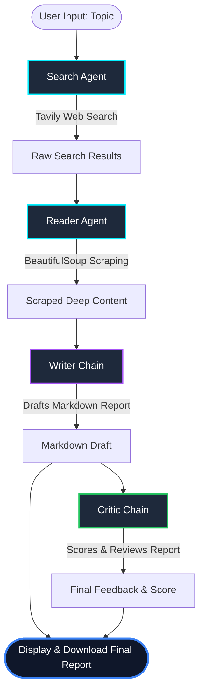

# 🔬 PrismAI: Next-Gen Multi-Agent Collaborative Research System

<p align="center">
  
  
  
  
  
</p>

---

## 🌌 Project Overview

**PrismAI** is a state-of-the-art **Multi-Agent Collaborative System** that automates deep, high-quality web research and report drafting. Using LangChain and powered by Mistral AI, PrismAI coordinates multiple specialized AI agents that work together in a structured pipeline: searching the live web, reading and scraping top resources, synthesizing a detailed report, and critiquing the draft for self-improvement.

PrismAI features a **futuristic, ultra-premium Web Dashboard** built on Streamlit, layered with custom WebGL (Three.js) 3D interactive graphics, mouse-tracking glow highlights, and glassmorphic designs that redefine the aesthetic expectations of machine learning dashboards.

---

## 🚀 Key Features

- **Multi-Agent Coordination Pipeline:** Uses LangChain to orchestrate specialized agents and chains, assigning dedicated roles to minimize hallucination and maximize content depth.
- **Live Web Intelligence:** Integrates the Tavily Search API to query real-time search results, extracting titles, URLs, and snippets.
- **Deep Scraping Agent:** Dynamically selects the most relevant URLs and utilizes BeautifulSoup4 to perform targeted scraping of content, bypassing boilerplate markup.
- **Automated Research Synthesizer:** Structures a formal research report complete with an _Introduction_, _Key Findings_, _Conclusion_, and a compiled list of _Sources_.
- **Self-Improving Critic Feedback:** An independent Critic agent reviews the drafted report, providing a score out of 10, outlining strengths, highlighting areas for improvement, and offering a one-line verdict.
- **Immersive Web UI Dashboard:** Streamlit UI augmented with interactive Three.js 3D wireframe canvases, custom CSS mouse-tracking spotlights, and modern typography (Syne & DM Sans).
- **Alternative Console Mode:** Offers a light-weight, terminal-based pipeline (`pipeline.py`) for rapid command-line research.

---

## 🛠️ System Architecture

PrismAI operates on a sequential flow, where each node passes its refined state to the next step:



### The Collaborative Roster:

1.  **🔍 Search Agent:** Gathers high-quality sources using Tavily web search.
2.  **📄 Reader Agent:** Selects the top source, downloads, cleanses, and reads the raw HTML.
3.  **✍️ Writer Chain:** Synthesizes gathered data into a structured, formal Markdown report.
4.  **🧐 Critic Chain:** Analyzes the report, identifies information gaps, and grades the quality.

---

## 📂 Project Directory Structure

```text
├── agents.py          # LLM configurations, system prompts, and LangChain Agent setup
├── tools.py           # Tavily Web Search and BeautifulSoup-based URL Scraping tools
├── pipeline.py        # Terminal-based research pipeline CLI
├── app.py             # Premium Streamlit Dashboard with Three.js graphics and WebGL Background
├── requirements.txt   # Project dependencies (LangChain, Streamlit, Tavily, BeautifulSoup, etc.)
└── .env               # API keys configuration (Excluded from git)
```

---

## ⚡ Getting Started

### 📋 Prerequisites

- Python 3.10 or higher installed.
- A **Mistral AI API Key** (obtainable from [Mistral AI Console](https://console.mistral.ai/)).
- A **Tavily API Key** (obtainable from [Tavily AI](https://tavily.com/)).

### 1. Clone the Repository

```bash
git clone https://github.com/your-username/prism-ai-model.git
cd prism-ai-model
```

### 2. Create and Activate a Virtual Environment

```bash
# Windows
python -m venv .venv
.venv\Scripts\activate

# macOS / Linux
python3 -m venv .venv
source .venv/bin/activate
```

### 3. Install Dependencies

```bash
pip install -r requirements.txt
```

### 4. Setup Environment Variables

Create a file named `.env` in the root directory:

```env
MISTRAL_API_KEY=your_mistral_api_key_here
TAVILY_API_KEY=your_tavily_api_key_here
```

### 5. Launch the Application

#### A. Interactive 3D Web Dashboard (Recommended)

Experience the system with real-time UI transitions and visual steps:

```bash
streamlit run app.py
```

#### B. Terminal-Based CLI

Run the pipeline directly in your console:

```bash
python pipeline.py
```

---

## 💻 Tech Stack & Frameworks

- **Orchestration**: [LangChain](https://www.langchain.com/) (LangChain Core, LangChain Community, LangChain MistralAI)
- **Large Language Model (LLM)**: Mistral AI (`mistral-small-2603` model)
- **Web Search API**: [Tavily AI](https://tavily.com/)
- **Scraping Engine**: BeautifulSoup4 + Requests
- **UI Dashboard**: Streamlit with customized inline CSS injection
- **3D Graphics Engine**: Three.js WebGL (Icosahedron & Octahedron interactive meshes with vector wave distortion)

---

## 📈 Recruiter Highlights (Key Architectures Illustrated)

If you are a recruiter looking at this repository, here are some highlights of the project's engineering patterns:

- **Custom Tool Bindings:** Demonstrated cleanly in [tools.py](file:///c:/Users/hv702/Downloads/multiagent/tools.py), showing how to hook up standard Python methods to LangChain agents with custom descriptions, schemas, and robust error management.
- **Separation of Concerns:** Clean architecture isolating agent definitions ([agents.py](file:///c:/Users/hv702/Downloads/multiagent/agents.py)), tools ([tools.py](file:///c:/Users/hv702/Downloads/multiagent/tools.py)), orchestration pipeline ([pipeline.py](file:///c:/Users/hv702/Downloads/multiagent/pipeline.py)), and UI layout ([app.py](file:///c:/Users/hv702/Downloads/multiagent/app.py)).
- **Self-Reflective Loops (RAG-Critic pattern):** Leverages a modern multi-agent design pattern where the generation agent is paired with a critic agent to enforce rigorous formatting and factual checking before displaying output.
- **Advanced WebGL Integrations in Python Dashboards:** Showcases how to bypass standard Streamlit layout limitations using raw HTML/JS injections to deliver high-performance 3D visual experiences.

---

_Developed by Harshit Verma (harshiit112) — Building intelligent agentic systems._
